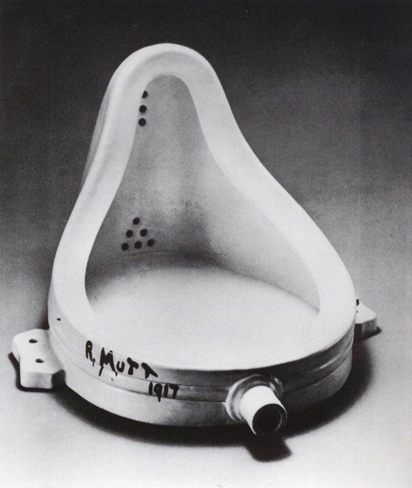
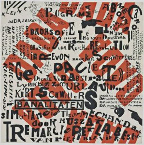
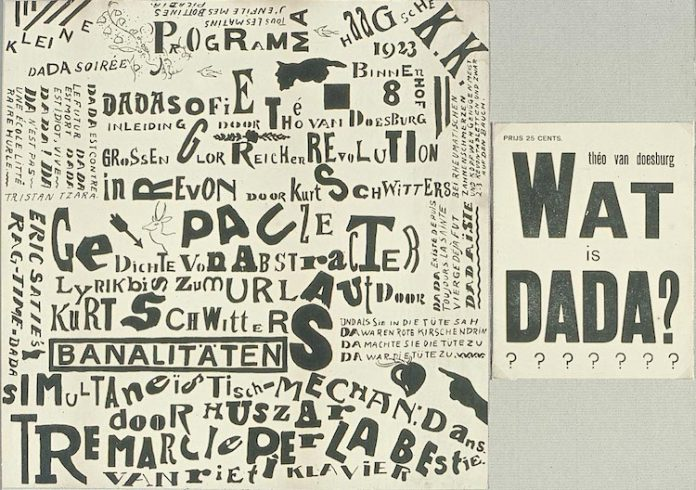

# Proyecto-interactividad
El nombre del presente proyecto es "DADA" y fue tanto concebida como redactada por Josefa Luque
El proyecto encuentra inspiracion en una de las vanguardias en especifico el dadaísmo, vanguardia que muchas veces cuestionaba al arte mismo y al sistema mediantes sus obras, especifico tomando en cuenta la obra de Marcel Duchamp 
En especifico lo que más inspirio el proceso de concepcion en la obra de Duchamp fue esta critica hacia la autoria de una obra, tomando esta idea se busco redirigira a un tema más actual, siendo el seleccionado el uso de la ia y si realmente el que pide una imagen a esta herramienta puede llamar aquella obra suya.

Para lograr transportar esta idea a codigo se busco referentes más orientados a la tipografia de la misma vanguardia como los siguientes  
