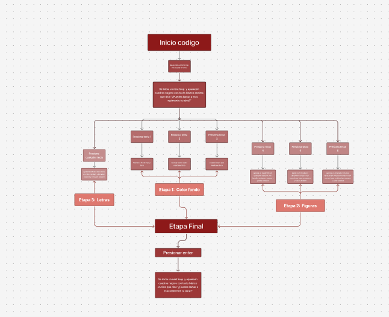
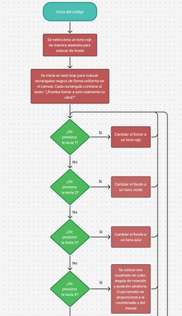
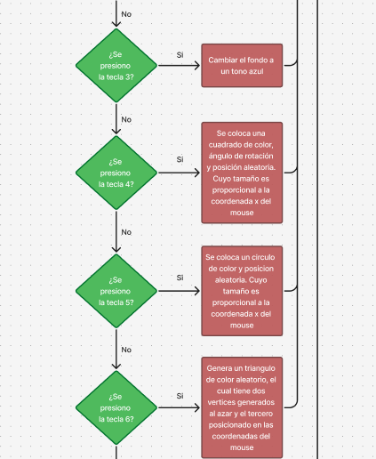
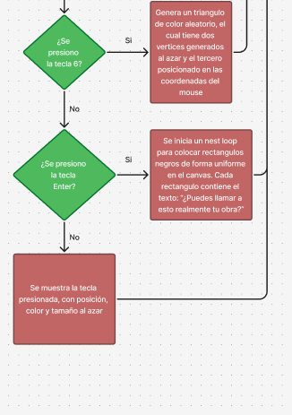

# Proyecto-interactividad
El nombre del presente proyecto es "DADA" y fue tanto concebida como redactada por Josefa Luque
El proyecto encuentra inspiración en una de las vanguardias en específico el dadaísmo, vanguardia que muchas veces cuestionaba al arte mismo y al sistema mediantes sus obras, especifico tomando en cuenta la obra de Marcel Duchamp 
En específico lo que más inspiró el proceso de concepción en la obra de Duchamp fue esta critica hacia la autoría de una obra, tomando esta idea se buscó redirigirá a un tema más actual, siendo el seleccionado el uso de la ia y si realmente el que pide una imagen a esta herramienta puede llamar aquella obra suya.

Para lograr transportar esta idea a código se buscó referentes más orientados a la tipografía de la misma vanguardia como los siguientes  

Tomando como idea central esta especie de azar en el orden de las letras, se tradujo usando en su mayoría el comando random.
Pasando a qué es lo que podemos ver en nuestra pantalla a lo largo del tiempo, comenzamos con un fondo de tono random rojo y dependiendo de si tocamos las teclas 1, 2 o 3, el color de fondo cambia o se mantendrá en rojo. En caso de presionar 4 se formarán cuadrados con ubicación y color random, el tamaño será en base a mousex. Si se presiona 5 se generará de la misma manera círculos y si se presiona 6 se generarán de la misma manera triángulos con la excepción de que el vértice final obtendrá su ubicación en base a la ubicación del puntero.

Todo el resto de teclas a exepcion de enter generaran la misma tecla en color y ubicacion random, finalmente una vez la persona quede satisfecha con el resultado se tiene la posibilidad de apretar enter, el cual iniciara un loop que genera multiples recuadros de color negro con texto en blanco en que se lee ¿Puedes llamar a esto realmente tu obra? buscando hacer hincapié en la idea de criticar en el proyecto.

En cuanto al diagrama de flujo correspondiente, se tuvo una primera versión la cual es la siguiente  Posteriormente se buscó orientación de alguien que tuviera más experiencia en la realización de estos y en base a esas correcciones se cambió al siguiente.   

Tal como muestra el diagrama corregido, existen múltiples opciones de interactividad independientes unas de otras, buscando que si bien la persona tenga influencia en la creación de una obra, no puedan controlar cosas como color y orientación, haciendo referencia a como al momento de generar imágenes con inteligencia artificial, si bien se pueden dar parámetros, la persona no decide todo en la obra.

El código se basa en la interacción con teclas, al momento de presionar la tecla correspondiente como por ejemplo el 4 (ya explicado anteriormente) este generará un cuadrado con coordenadas random, color random y rotación random. En caso de el fondo de color estos funcionan con array, si precionas 1 se selecciona la opcion 0 en el array que corresponde a un tono de rojo random, en caso del dos, seleciona el 1 que es un tono random de verde y por concecuencia el 3 corresponde al 2, un tono random de azul.

Para el loop de este código me vi obligada a consultar con un estudiante de licenciatura en matematicas que ya a trabajado con codigo, debido a que la dificultad se escapaba de mis manos, en base a sus consejos es que puse limpiar y organizar de mejor manera mi código y a la vez fue posible lograr el loop deseado. la parte más compleja era que el loop aprendido en clases usa solo 2 coordenadas, en cambio con un cuadrado este usa 8. Debido a esto es que se aplicó la siguiente lógica, para que el espacio sobrante entre cuadrado y cuadrado esté distribuido, se resta el espacio ocupado por todos los cuadrados que caben tanto de manera vertical como horizontal y posteriormente dividiendo ese espacio en 5 para el presente caso en horizontal. De esta manera es que las coordenadas necesarias para cada cuadrado nacen de las coordenadas dadas por el proceso anterior, para el texto, se orientó de manera manual.

Doy especiales agradecimientos a Felipe Paredes quien me dio recomendaciones para lograr el efecto deseado con mi código.

https://editor.p5js.org/josefa.luque/sketches/-wKy1AMd9
